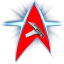

# Star Trek Online Combat Real-Time Display

* [Overview](#overview)
* [Building](#building)
* [Disclaimer](#disclaimer)

---
## Overview
This is a PC application used to analyze and display Star Trek Online combat data in real-time.

---
## Building
The source in this repo is wrapped up in a Visual Studio 2022 solution. You should be able to clone this repo localy, then build and run from inside of Visual Studio.

You could also run the dotnet cli build and run commands from inside the zxeltor.StoCombatAnalyser.Interface project folder as well.

---

## Disclaimer
This software and any related documentation is provided “as is” without warranty of any kind, either express or implied, including, without limitation, the implied warranties of merchantability, fitness for a particular purpose, or non-infringement. Licensee accepts any and all risk arising out of use or performance of Software

**Note:** We are not affiliated, associated, authorized, endorsed by, or in any way officially connected with the game Star Trek Online, or any of its subsidiaries or its affiliates. The official Star Trek Online website can be found at [https://www.playstartrekonline.com/](https://www.playstartrekonline.com/en/
